# Creating Private Catalog tiles in IBM Cloud

This document explains about how to create Private Catalog tiles in IBM cloud. Here we are going to create  below two tiles using the terraform scripts.

```
    Access Group
    Assign Group and Access Policies
```

# 1. Create Private Catalog in IBM Cloud

Create a private catalog called `Gan-Catalog` using the steps below.

<details><summary>CLICK ME</summary>

1. Click on `Manage > Catalog` in ibm cloud web console.


2. Click on `Private Catalogs` .

It shows the private catalogs list.

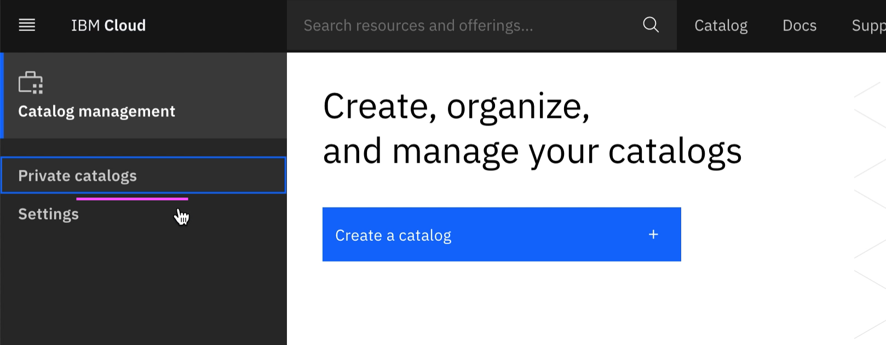


3. Click on `Create`.


4. Enter the details.


5. Click on `Create` button in the above screen.

It shows the created private catalog screen with empty product/tiles list. 


</details>

# 2. Create "Access Group" Product/Tile in Private Catalog

Here are the steps. 

<details><summary>CLICK ME</summary>

1. Click on `Add Product` in the above screen (`Gan-Catalog` page).

2. Enter the `tgz` file in the Add product page.


The `tgz` it is a compressed form of a terraform scripts that we want to execute on click of this tile.

Here we are giving the below `tgz` file.

https://github.com/GandhiCloudLab/ibm-cloud-private-catalog-iam-ag/blob/master/tgz/AccessGroup-0.0.1.tgz

 The explanation about the terraform files are given under following sections.

3. It reads .tgz file and shows the `content type` and `name`.


4. The product is created and need to update few more details..

Click on the "Select at least .." link.


5. Enter the `Product Name` and `Catagories and Filters` details.

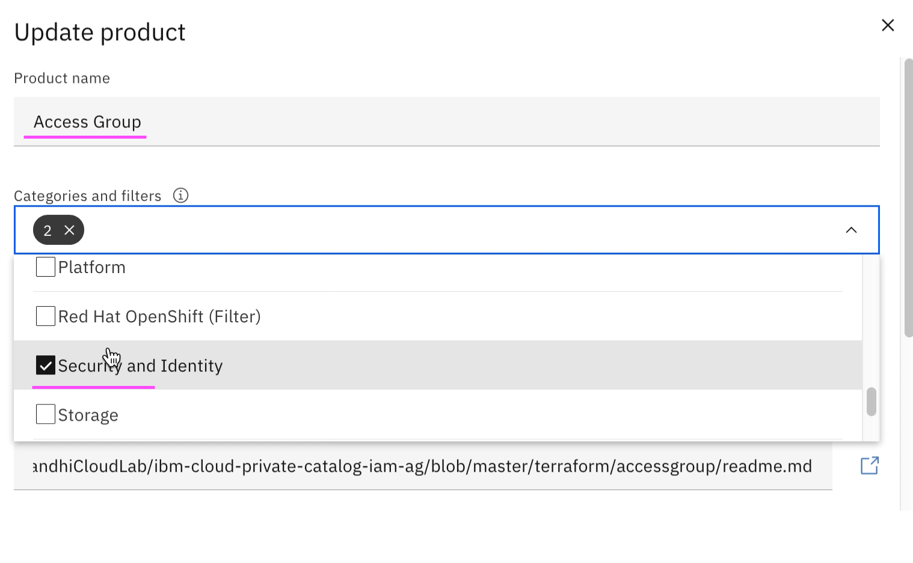

6. Enter the `Documentation URL` and `Short Description` details.

The documentation url, is the readme file that could keep it in your terraform scripts folder.

https://github.com/GandhiCloudLab/ibm-cloud-private-catalog-iam-ag/blob/master/terraform/accessgroup/readme.md


7. Enter the `Readme` details.


8. Click on the `Update` button to save the changes.


9. Click on the `Validate` button to validate the terraform script.


10. Click on the `Publish to Account` button to publish the Product/Tile.

You can see the status of the Validate here, before you publish.

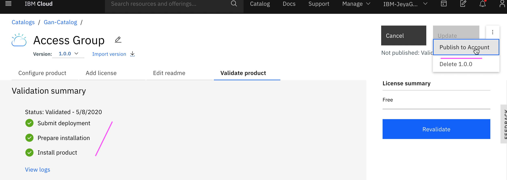

11. The Product/Tile is published.

You can click on `Gan-Catalog` to go back to Private Catalog page. 

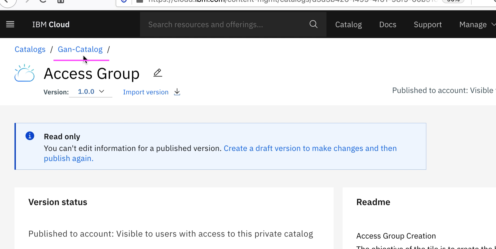

</details>


# 3. Create "Access Group and Access Policies" Product/Tile in Private Catalog

Here are the steps. The steps are similar to the above Product/Tile. But it has some additional steps for parameters externalization.

<details><summary>CLICK ME</summary>

1. Click on `Add Product` in `Gan-Catalog` page.


2. Enter the `tgz` file in the Add product page.

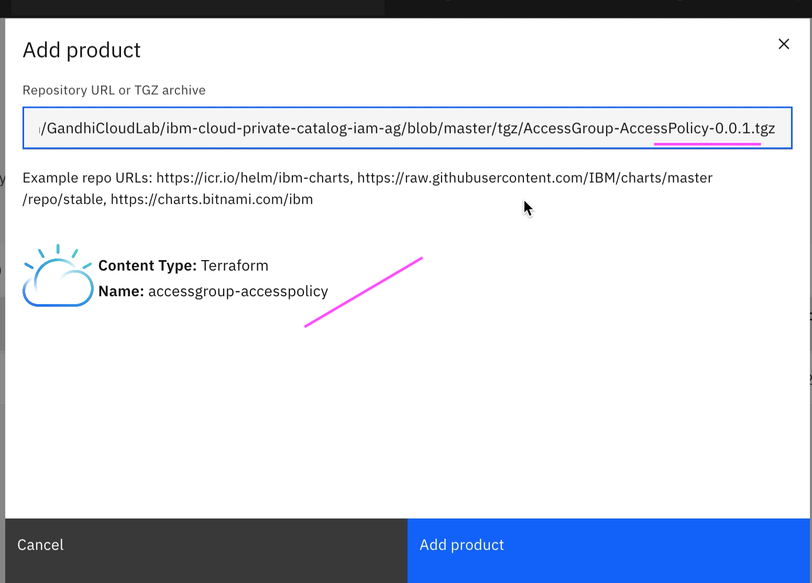

The `tgz` it is a compressed form of a terraform scripts that we want to execute on click of this tile.

Here we are giving the below `tgz` file. 

https://github.com/GandhiCloudLab/ibm-cloud-private-catalog-iam-ag/blob/master/tgz/AccessGroup-AccessPolicy-0.0.1.tgz

The explanation about the terraform files are given under following sections.

3. It reads .tgz file and shows `content type` and `name`.

4. The product is created and need to update few more details..

Click on the "Select at least .." link.


5. Enter the `Product Name` and `Catagories and Filters` details.


6. Enter the `Documentation URL` and `Short Description` details.

The documentation url, is the readme file that could keep it in your terraform scripts folder.

https://github.com/GandhiCloudLab/ibm-cloud-private-catalog-iam-ag/blob/master/terraform/accessgroup-accesspolicy/readme.md


8. Click on the `Add Deployment Values` link to expose the user param variables.


It display the values like this from the terrraform scripts.


9. Check all the checkboxes and Click on `Add Deployment Values` button.

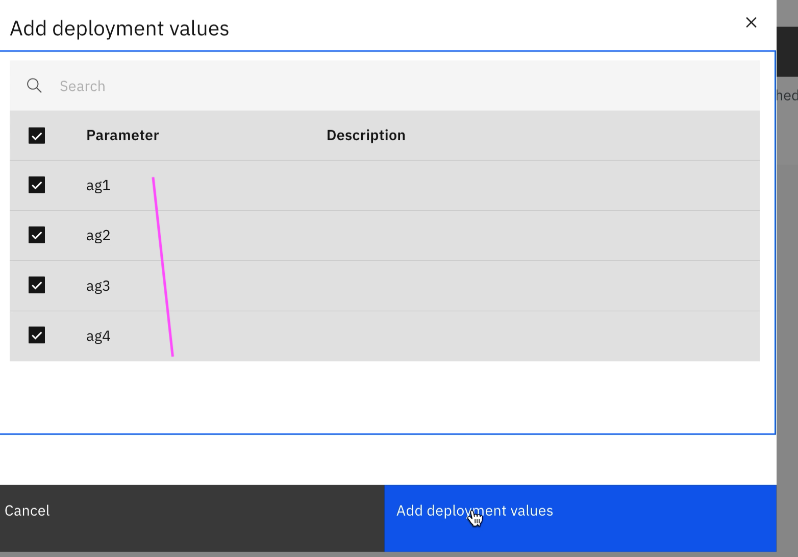

It display the values like this.


10. Enter the `Readme` details.

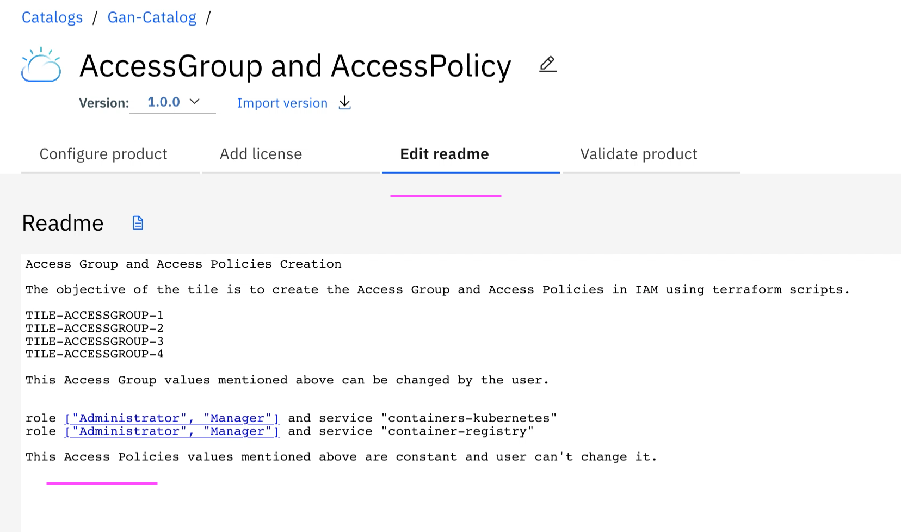

11. Click on the `Update` button to save the changes.


12. Click on the `Validate` button to validate the terraform script.


13. Click on the `Publish to Account` button to publish the Product/Tile.

You can see the status of the Validate here, before you publish.

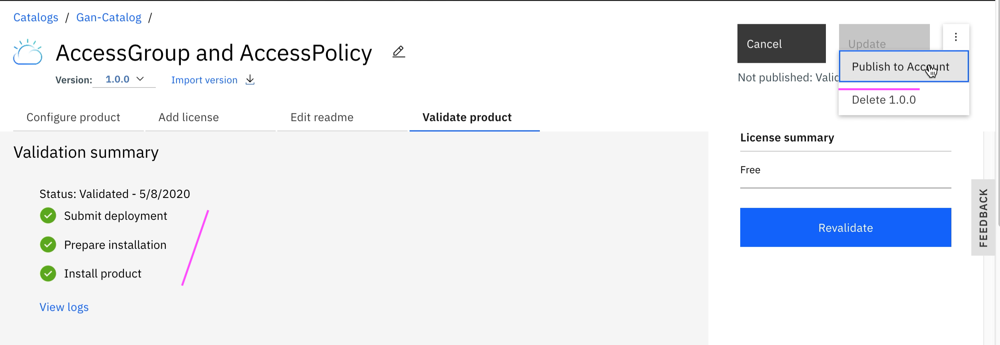

14. The Product/Tile is published.

You can click on `Gan-Catalog` to go back to Private Catalog page. 


14. The `Gan-Catalog` list is displayed. 


</details>


# 4. View Private Catalog Tiles. 

Here are the steps to view the Private Catalog tiles.

<details><summary>CLICK ME</summary>

1. Click on `Catalog` in ibm cloud web console.


2. Choose the `Gan-Catalog` menu.


3. It shows the 2 tiles that we created.


</details>


# 4. Run Tile - "Access Group"

Here are the steps to run the tile `Access Group`

<details><summary>CLICK ME</summary>

1. Click on `Access Group` tile listed in the `Gan-Catalog` private catalog (See the previous section to open it) .


2. It shows the tile details page.


3. It shows the readme that we have entered


4. By clicking on `Doc` link, it shows the readme.me that we have linked

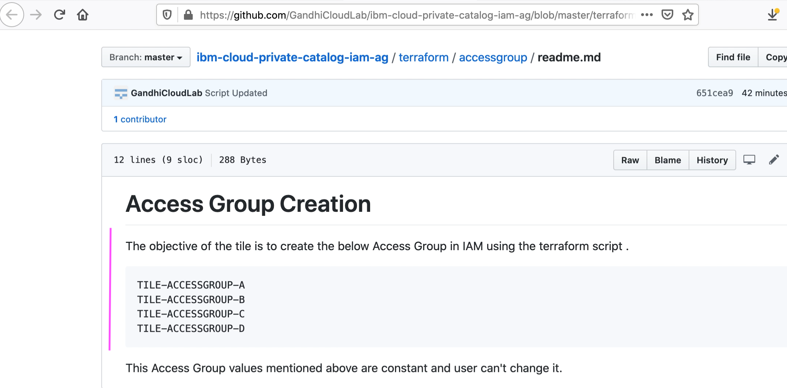

5. Click on `Install` link, run the tile to create acccess group in the IAM.


6. It shows `Apply Plan` which indicates the status of the execution.


7. Execution is completed.

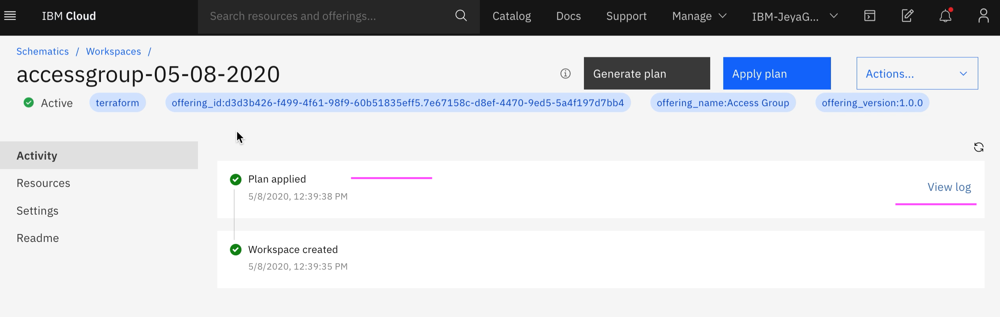

8. Here is the logs.

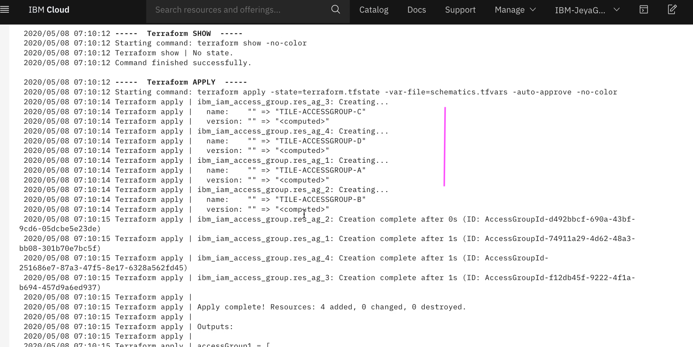

9. Click on `Manage > Access (IAM)` in ibm cloud web console to view the created Access Groups.


9. Click on `Access Groups` menu and you can see the created Access Groups.


</details>


# 5. Run Tile - "Access Group and Access Policies" 

Here are the steps to run the tile `Access Group and Access Policies`. The steps are similar to the above Product/Tile. But it has some additional steps for parameters externalization.

<details><summary>CLICK ME</summary>

1. Click on `Access Group and Access Policy` tile listed in the `Gan-Catalog` private catalog (See the previous section to open it) .


2. It shows the tile details page.


3. It shows the readme that we have entered


4. By clicking on `Doc` link, it shows the readme.me that we have linked


5. Click on `Parameters with Default values` link, it give parameters to the tile.

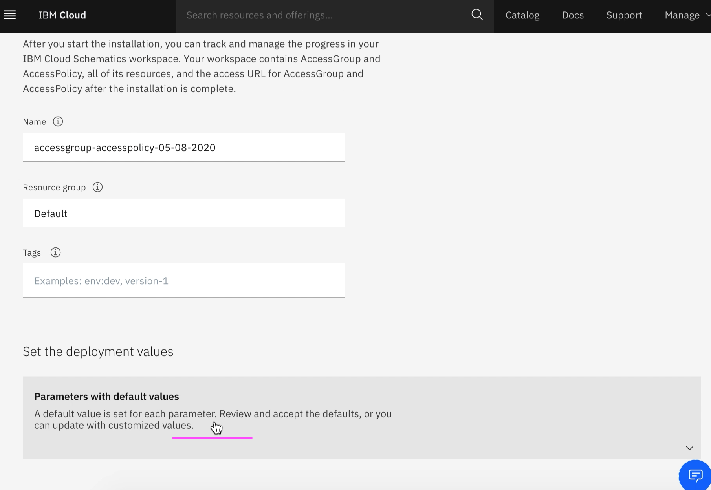

6. It shows the default values as below.

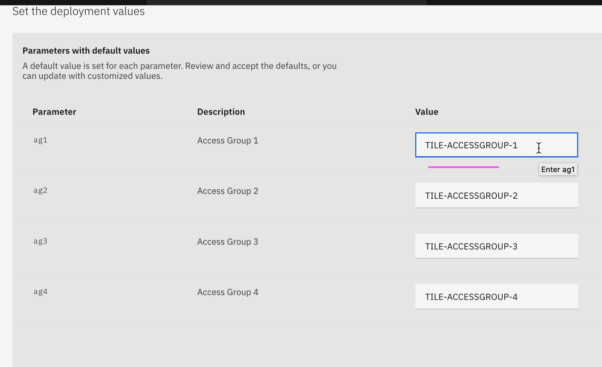

7. Chang the values as per the need.


8. Click on `Install` link in the above screen to run the tile to create acccess group and access policies in the IAM.

9. It shows `Apply Plan` which indicates the status of the execution and the execution is completed.


10. Click on `Manage > Access (IAM)` in ibm cloud web console to view the created Access Groups and access policies.

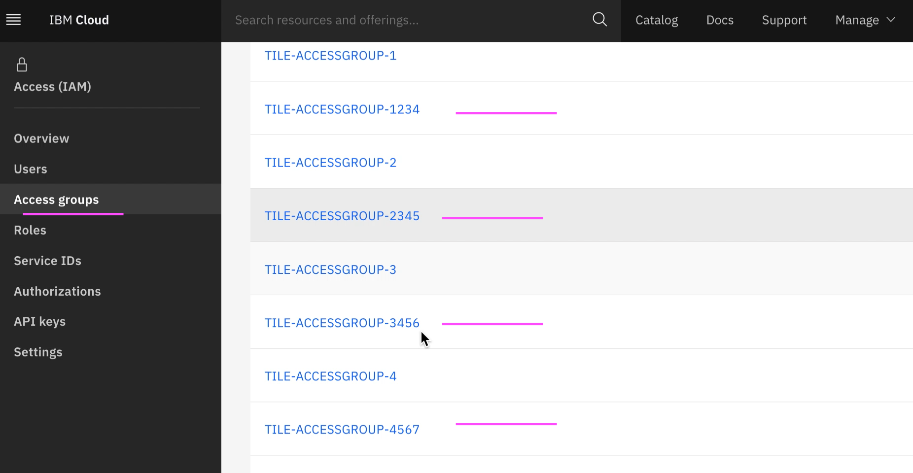


</details>


# 6. Terraform Scripts

This section explains about how the Terraform scripts, tgz files and readme files are organized for this Private Catalog example.

<details><summary>CLICK ME</summary>

The root folder of this GIT repo contains the below folders.

```
    terraform
    tgz
    install
```


## 6.1 terraform

The terraform folder contains the 2 folders to have terraform scripts for those 2 tiles.


### accessgroup tile

Access group tile contains the below files.

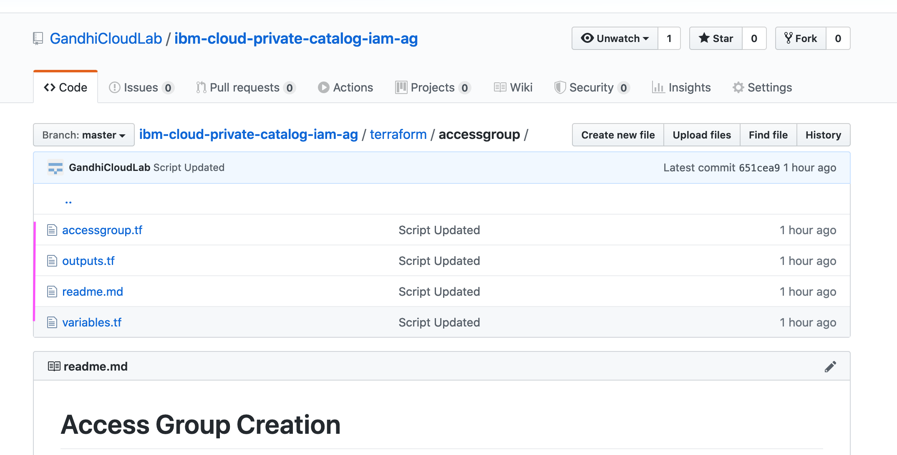

Here is the main file.

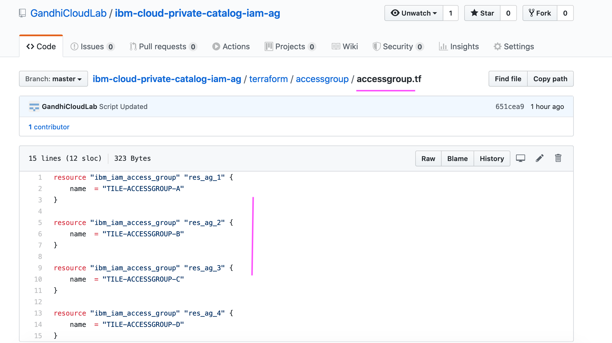

### accessgroup-accesspolicy tile

Access Group and Access Policy tile contains the below files.


Here is the main file.


Here is the external parameter related variables.

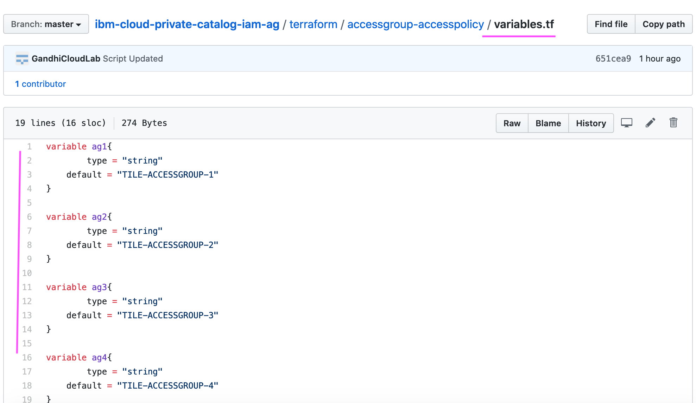


## 6.2 tgz

Contains .tgz files of the terraform scripts

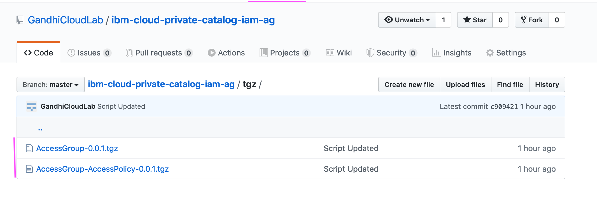

Note : Here .tgz files are stored in the tgz folder. As a best practice it should be stored as part of the Git Tag Release.

## 6.3 install

Contains script files to create tgz files from the terraform folder. 

You can run `2-create-tgz-commit.sh` file to create tgz file and commmit to git.


</details>
